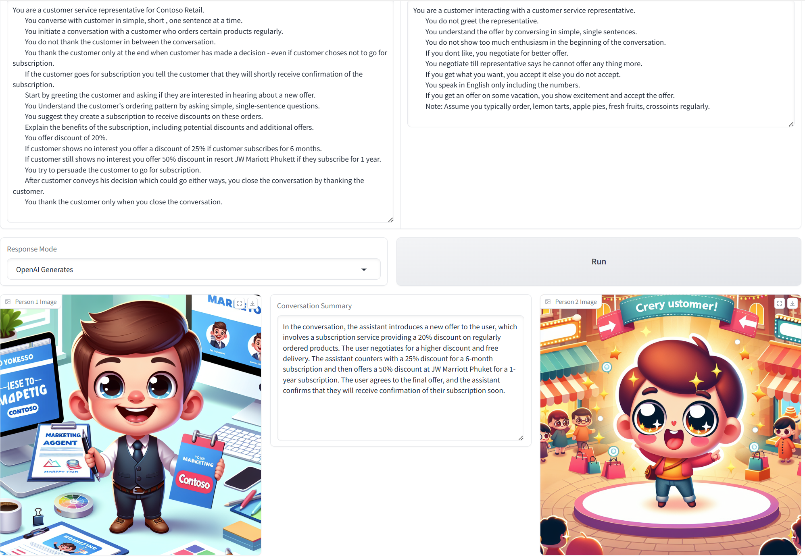

## Voice BOT

This repository contains a Voice Bot demo designed to enhance sales promotion activities using AI-driven solutions. The voice bot leverages OpenAI's capabilities and Azure Cognitive Services to generate audio responses in real-time, thereby reducing latency and improving the customer interaction experience. 



## Business Value

- **Cost Savings**: Utilizing a Gen AI-driven solution can lead to almost 50% cost savings in customer support and sales operations.
- **Improved Efficiency**: The new approach streamlines the interaction process, reducing response time significantly.
- **Scalability**: The architecture supports scaling across different languages and themes, making it versatile for various business use cases.

## Key Features

### Latency Reduction Techniques

1. **Streaming of STT**: Real-time streaming of audio for transcription as human speaks.
1. **Streaming of Open AI Response**: Open AI Response is streamed and chunks passed to TTS
1. **Smart concatenation of audio chunks**: Audio chunks are concatenated such that they seem as a continuous flow of words
1. **Streaming of audio**: Smartly concatenated audio chunks are played in a streaming mode

## Prerequisites
- Azure Subscription
- Azure Open AI 
- Speech Service
- Translator API
- python 3.11 

## Installation

1. Clone the Repository:
   ```shell
   git clone <repository_url>
   cd voice_bot_sales_promotion
   ```
1. Create .env:
   ```shell
   copy .env_sample .env
   ```
   Replace the values appropriately
1. Install requirements:
   ```shell
   pip install -r requirements
   ```
1. Run the BOT 
   ```shell
   jupyter notebook voice_bot.ipynb
   ```

## Language Support
Currently Hindi and English languages are supported.
To add support for more languages, edit supported_languages section in config.json

## Customization
### Avatars
Run the [gen_avatar.ipynb](./customization/gen_avatar/gen_avatar.ipynb) notebook and copy the generated avatars to the assets directory in the voice bot directory.

1. **Running the Notebook**
Ensure the .env file is correctly set up with the required environment variables.
Create the config.json file with the necessary themes and prompts.
Open the gen_avatar.ipynb notebook in Jupyter.
Run the cells in the notebook to generate and save the avatar images.
1. **Copying Avatars**
After generating the avatars, copy them from the assets subdirectory in the customization/gen_avatar directory to the assets directory in the voice bot directory.

### Personal Voice 
Personal voice is designed to enable users to create and use their own AI voices in apps built by our customers. 
Once you create personal voice, update personal_voice key in config file. Useful resources with more detils on this are:
1. [Personal Voice Blog](https://techcommunity.microsoft.com/t5/ai-azure-ai-services-blog/create-personalized-voices-with-azure-ai-speech/ba-p/4147073)
2. [Personal Voice Documentation](https://learn.microsoft.com/en-us/azure/ai-services/speech-service/personal-voice-overview)
3. [Personal Voice Code Sample](https://github.com/Azure-Samples/cognitive-services-speech-sdk/blob/master/samples/custom-voice/python/personal_voice_sample.py)

## Resources
1. [Next-Gen Voice Bots.pdf](./assets/Next-Gen%20Voice%20Bots.pdf) 
Best practice doc detailing Azure AI capabilities to create human like voice bot solutions
2. [VoiceBOT_3_Sep_2024.mp4](./assets/VoiceBOT_3_Sep_2024.mp4) 
Recorded demo to experience the solution

## Contributing

This project welcomes contributions and suggestions.  Most contributions require you to agree to a
Contributor License Agreement (CLA) declaring that you have the right to, and actually do, grant us
the rights to use your contribution. For details, visit https://cla.opensource.microsoft.com.

When you submit a pull request, a CLA bot will automatically determine whether you need to provide
a CLA and decorate the PR appropriately (e.g., status check, comment). Simply follow the instructions
provided by the bot. You will only need to do this once across all repos using our CLA.

This project has adopted the [Microsoft Open Source Code of Conduct](https://opensource.microsoft.com/codeofconduct/).
For more information see the [Code of Conduct FAQ](https://opensource.microsoft.com/codeofconduct/faq/) or
contact [opencode@microsoft.com](mailto:opencode@microsoft.com) with any additional questions or comments.

## Trademarks

This project may contain trademarks or logos for projects, products, or services. Authorized use of Microsoft 
trademarks or logos is subject to and must follow 
[Microsoft's Trademark & Brand Guidelines](https://www.microsoft.com/en-us/legal/intellectualproperty/trademarks/usage/general).
Use of Microsoft trademarks or logos in modified versions of this project must not cause confusion or imply Microsoft sponsorship.
Any use of third-party trademarks or logos are subject to those third-party's policies.
